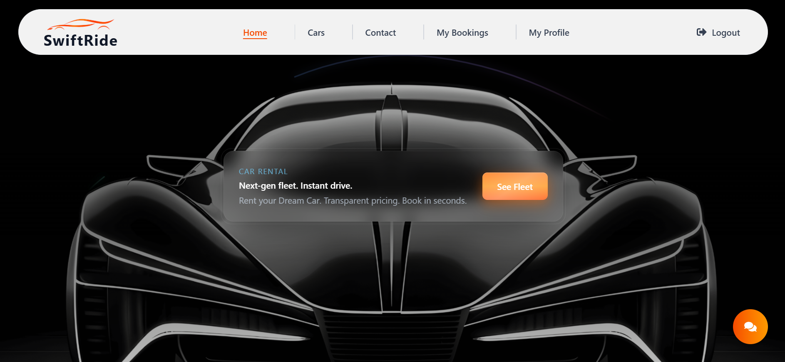
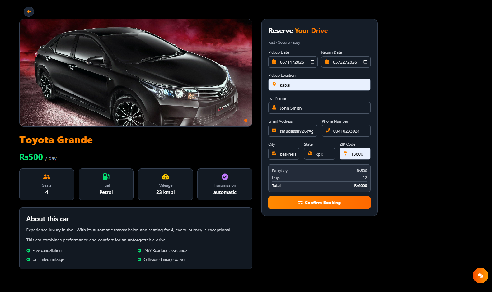
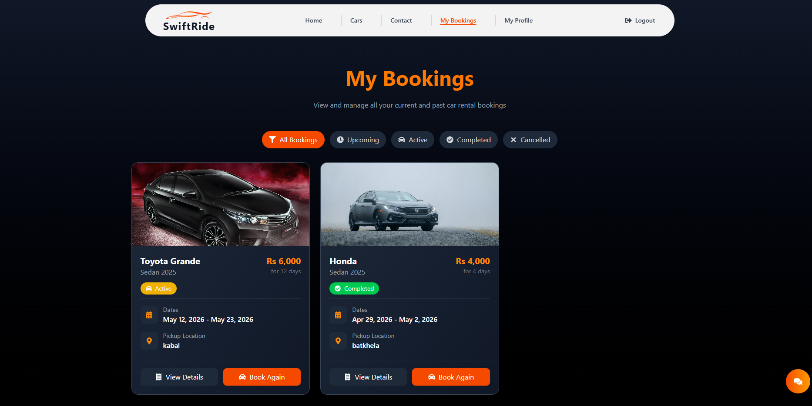
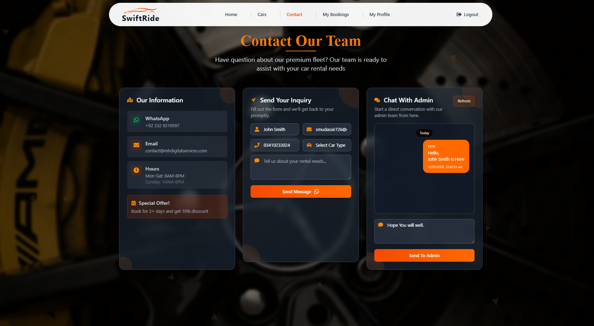
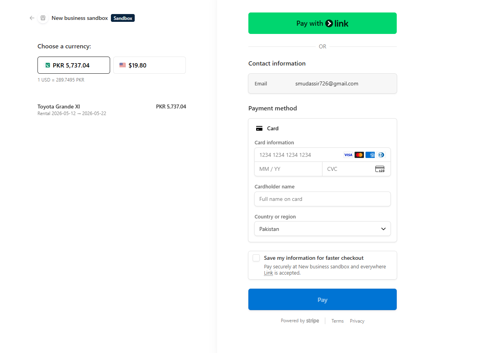
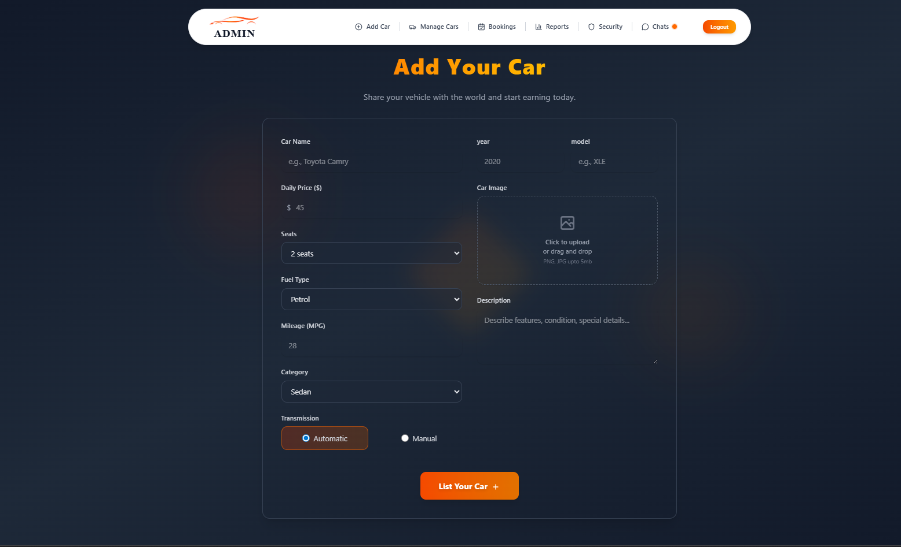
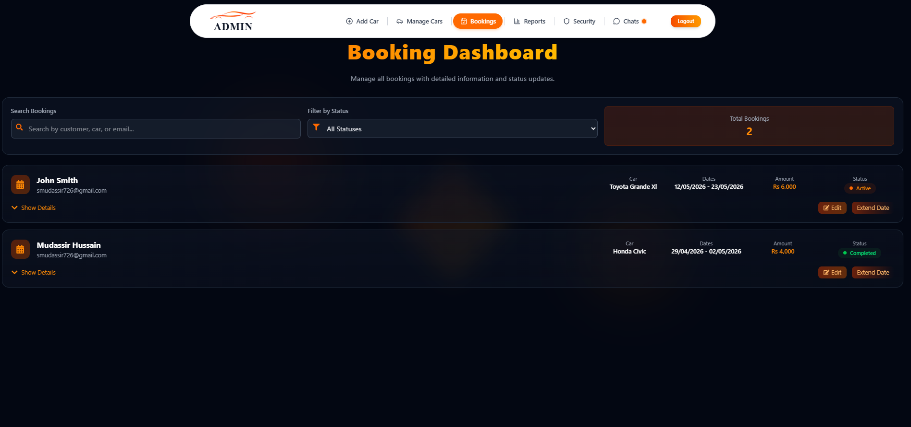
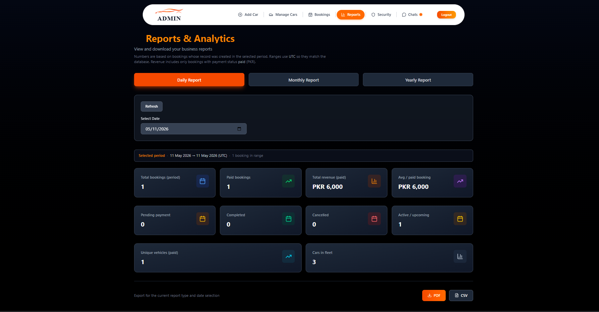
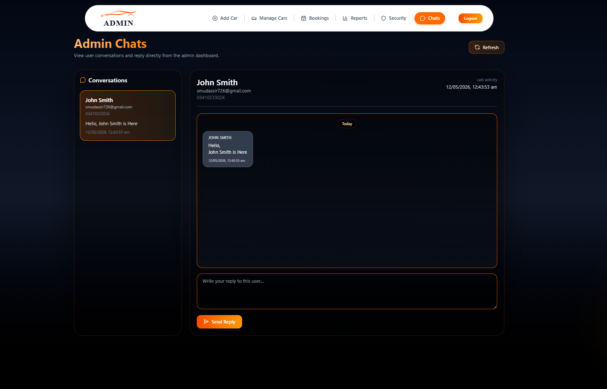

# Real-Time Vehicle Booking Platform

A full-stack **Real-Time Vehicle Booking Platform** built using **React**, **Tailwind CSS**, **Node.js**, **Express.js**, and **MongoDB**. The platform allows customers to browse available vehicles, make online bookings, communicate with the administrator, and manage their reservations through a modern and responsive interface.

The system also includes a comprehensive **Admin Dashboard** for managing vehicles, bookings, users, payments, and reports, making it suitable for real-world vehicle rental businesses.

---

## Features

### Customer Features

* User registration and secure authentication
* Browse available vehicles
* Search and filter vehicles
* View vehicle details
* Real-time vehicle availability
* Online vehicle booking
* Booking management
* Rental history
* Booking cancellation
* Booking extension requests
* Secure online payments
* Real-time chat with administrator
* WhatsApp communication
* Email notifications
* Responsive user interface

---

### Admin Features

* Secure administrator login
* Dashboard overview
* Vehicle management (Add, Update, Delete)
* Booking management
* Customer management
* Payment management
* Revenue monitoring
* Booking approval and status updates
* Daily, monthly, and yearly reports
* Image management
* Professional admin dashboard

---

## Technologies Used

### Frontend

* React
* Tailwind CSS
* JavaScript (ES6)
* HTML5
* CSS3

### Backend

* Node.js
* Express.js

### Database

* MongoDB

### Authentication

* JWT Authentication
* Bcrypt

### APIs & Integrations

* Green API (WhatsApp Messaging)
* Nodemailer (Email Notifications)
* Stripe Payment Gateway
* Cloudinary (Image Upload & Management)
* REST APIs

### Other Tools

* Socket.IO (Real-time Communication)
* Git
* GitHub
* Postman

---

## Project Structure

```text
real-time-vehicle-booking-platform/
│
├── admin/
│   ├── public/
│   ├── src/
│   │   ├── components/
│   │   ├── pages/
│   │   ├── context/
│   │   ├── socket/
│   │   ├── services/
│   │   └── assets/
│
├── backend/
│   ├── config/
│   ├── controllers/
│   ├── middleware/
│   ├── models/
│   ├── node_modules/
│   ├── routes/
│   ├── scripts/
│   ├── socket/
│   ├── utils/
│   └── uploads/
│ 
├── admin/
│   ├── public/
│   ├── src/
│   │   ├── components/
│   │   ├── pages/
│   │   ├── context/
│   │   ├── utils/
│   │   └── assets/
│
├── screenshots/
│   ├── homepage.png
│   ├── booking-page.png
│   ├── vehicle-details.png
│   ├── chat.png
│   ├── checkout.png
│   ├── admin-dashboard.png
│   ├── booking-management.png
│   ├── admin-chat.png
│   └── reports.png
│
├── README.md
└── .gitignore
```

---

## Screenshots

### Home Page



### Vehicle Details



### Booking Page



### Customer Chat



### Checkout



### Admin Dashboard



### Booking Management



### Admin Report



### Admin Chat




---

## Getting Started

### Clone the Repository

```bash
git clone https://github.com/yourusername/real-time-vehicle-booking-platform.git
```

### Install Dependencies

#### Frontend

```bash
cd client
npm install
npm run dev
```

#### Backend

```bash
cd server
npm install
npm start
```

---

## Learning Objectives

This project helped me improve my understanding of:

* Full-Stack Web Development
* MERN Stack Architecture
* React Component Design
* REST API Development
* JWT Authentication
* MongoDB Database Design
* Express.js Backend Development
* State Management
* API Integration
* Payment Gateway Integration
* Real-Time Communication
* File Upload Management
* Responsive Web Design
* Dashboard Development
* Role-Based Access Control
* Git & GitHub Collaboration

---

## Future Improvements

* Mobile application using Flutter
* GPS-based vehicle tracking
* AI-powered vehicle recommendations
* Push notifications
* Multi-language support
* Advanced analytics dashboard
* Driver management module
* Vehicle maintenance scheduling

---

## Author

**Mudassir Hussain**

Junior Flutter & Full-Stack Developer
